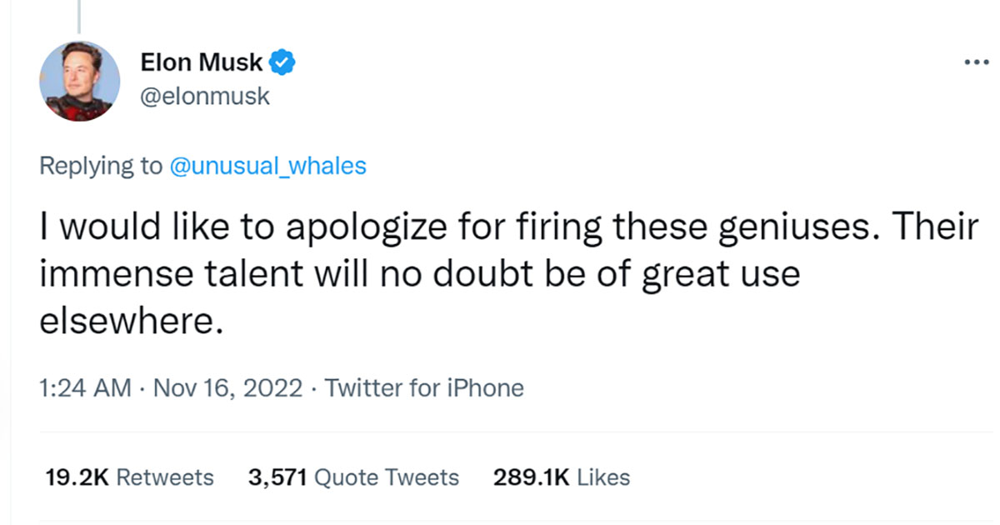

# Twitter, Apple, Meta, and other big tech companies together fired thousands of employees in last few months
### Big tech giants including Apple, Meta, Twitter, Amazon and others are suffering the worst from the ongoing economic slowdown. This has lead to mass layoffs at top tech firms.

I decided to try and build this project to see if I can build an ML model which can predict salaries for various engineering roles throughout the world. In the difficult time of economic slowdown and mass layoffs, models like these maybe of help to the unemployed to gather salary information. 

PS: ultimate aim : Build an AI equivalent of Glassdoor
